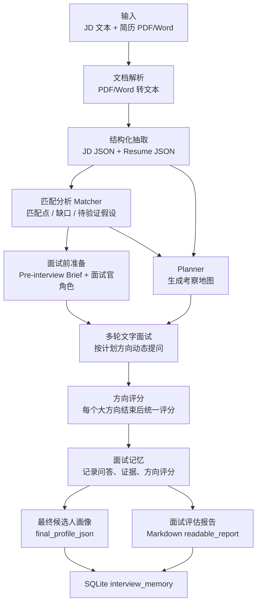
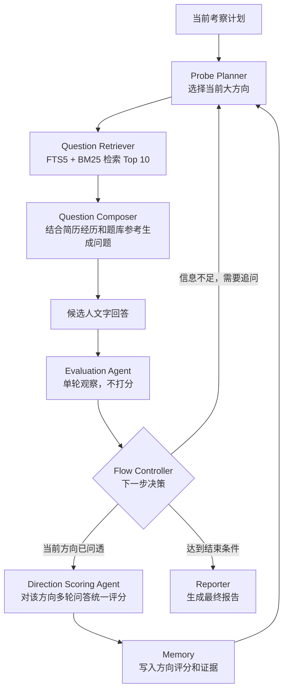

# AI 模拟面试官 Agent MVP

这是一个面向“智能招聘助手 MVP”笔试题的端到端 Demo，选择场景 B：AI 模拟面试官 Agent。

系统目标不是做一个完整 ATS，而是跑通一条核心闭环：把非结构化的 JD 和简历转成稳定结构化信息，再生成面试计划，进行多轮动态追问，最后输出面试评估报告和可复用的候选人画像。

## 功能概览

- 上传简历 PDF / Word，粘贴 JD 文本。
- 使用 LLM 将 JD 和简历结构化，抽取岗位要求、业务场景、候选人技能、项目、实习/工作经历等。
- 基于结构化 JD 和简历生成面试前匹配分析，识别匹配点、能力缺口和待验证假设。
- 根据匹配结果和简历内容生成面试考察计划，不固定轮次。
- 面试过程采用文字交互：面试官展示问题，候选人输入回答。
- 每一轮回答后由 Evaluation Agent 做观察，判断是否需要追问。
- 每个“大方向”结束后，由 Direction Scoring Agent 对该方向下的多轮问答统一评分和写评语。
- 面试结束后生成面向招聘负责人阅读的 Markdown 报告。
- 使用 SQLite 单表保存最近一次面试记忆，包括问答、方向评分、最终候选人画像等。

## 技术栈

- 前端交互：Streamlit
- LLM 接入：OpenAI SDK 兼容接口，可接 OpenAI、Qwen、Kimi、GLM 等兼容 Chat Completions 的模型服务
- 文档解析：PyMuPDF、python-docx
- 结构化建模：Pydantic
- 题库检索：SQLite FTS5 + BM25
- 记忆持久化：SQLite 单表 + JSON 字段
- 配置管理：python-dotenv + `.env`

## 核心技术点

### 1. 结构化优先

JD 和简历不会直接丢给面试 Agent。系统先通过 `src/structurer.py` 把非结构化文本变成 JSON。

JD 结构化字段包括：

- `job_title`：岗位名称
- `business_context`：业务背景
- `responsibilities`：核心职责
- `required_skills`：必备能力
- `preferred_skills`：加分项
- `core_capabilities`：核心能力画像

简历结构化字段包括：

- `candidate_name`：候选人姓名
- `skills`：技能
- `education`：教育经历
- `internships`：实习/工作经历
- `projects`：项目经历
- `papers`：论文
- `competitions`：竞赛/奖项

结构化层只抽取事实，不提前生成风险判断。风险点由 Matcher、Evaluator 和 Direction Scoring Agent 在后续阶段基于证据逐步产生。

### 2. Matcher 只做面试前分析

`src/matcher.py` 负责把 JD 要求和简历事实对齐，输出面试前的匹配分析。

它不做最终录用判断，也不输出分数，主要产出：

- 候选人与岗位匹配的能力点
- 简历中没有充分体现的能力缺口
- 面试中需要验证的假设
- 值得深挖的项目、实习或工作经历
- 建议优先考察的方向

这样设计的原因是：Matcher 的职责是帮助面试开始得更准，而不是在没有问答证据时过早给候选人下结论。

### 3. Planner 生成“考察地图”，不是固定题单

`src/planner.py` 根据 JD、简历和 Matcher 结果生成面试计划。计划不是固定 8 轮，也不是提前写死每一道问题，而是生成两类稳定的大方向：

- `experience_probe_plan`：围绕项目、实习、工作经历生成考察方向。
- `skill_scenario_plan`：围绕技能和业务场景生成考察方向。

例如一个项目可能生成 2-3 个方向：

- 个人贡献与真实性
- 方法链路与执行过程
- 结果指标与复盘能力

后续面试过程中，大方向保持稳定，小问题根据候选人具体经历、上一轮回答和题库检索结果动态生成。

### 4. 题库检索辅助动态提问

`src/question_retriever.py` 使用 SQLite FTS5 + BM25 从本地题库取 Top 10 相关问题。

设计原则：

- 检索题库是为了提供参考，不是照抄题库问题。
- 当前考察大方向不变。
- `src/question_composer.py` 会结合候选人的具体项目/经历、当前方向、上一轮回答和题库参考，生成一个更贴合上下文的问题。

这比纯 LLM 生成更稳定，也比固定题单更适合多轮追问。

### 5. 提问、观察、评分分离

系统把面试过程拆成三个角色：

- Interviewer Agent：负责生成当前问题。
- Evaluation Agent：负责观察单轮回答，判断是否需要追问，不打分。
- Direction Scoring Agent：一个大方向结束后，汇总该方向下的多轮问答，给 1-4 档评分和评语。

这样避免每个小问题都打分导致噪声过大。小问题只是采证工具，真正评分对象是 Planner 生成的大方向。

方向评分四档：

```text
1 = 未验证：回答空泛、回避，或明确不是本人负责。
2 = 部分验证：有局部经验，但缺少关键细节或证据。
3 = 基本验证：有真实实践和主要细节，但指标、边界或复盘不够完整。
4 = 充分验证：回答具体，有个人贡献、方法细节、指标证据和复盘思考。
```

### 6. Flow Controller 控制追问与切换

`src/flow_controller.py` 根据 Evaluation Agent 的结构化观察和当前 Memory 状态决定下一步：

- 继续围绕当前方向追问
- 当前方向结束，进入 Direction Scoring Agent
- 切换到下一个计划方向
- 面试结束，生成报告

Memory 只负责记录状态和证据，不负责做流程决策。这样职责更清楚，也方便后续调参。

### 7. 长期记忆设计

系统当前使用一张 SQLite 表 `interview_memory` 保存最近一次面试。

核心保存内容：

- JD 原文、简历原文
- JD / 简历结构化 JSON
- Matcher 结果
- 面试计划
- 多轮问答记录
- 每个大方向的评分与评语
- `final_profile_json`
- 最终展示报告 `report_json`

其中 `final_profile_json` 是长期候选人画像，用于后续面试或后续系统读取。最终 Markdown 报告是给人看的展示材料，不作为长期画像本体。

## 系统流程图

### 端到端主流程



### 面试循环内部



## 代码模块说明

- `app.py`：Streamlit 入口，负责页面状态和端到端编排。
- `src/document_loader.py`：解析 PDF / Word 简历。
- `src/structurer.py`：JD 和简历结构化抽取。
- `src/matcher.py`：JD-Resume 匹配分析。
- `src/config_parser.py`：解析用户自然语言面试要求。
- `src/role_builder.py`：生成面试官角色设定。
- `src/planner.py`：生成面试考察地图和建议轮次。
- `src/probe_planner.py`：选择当前大方向，生成检索 query。
- `src/question_retriever.py`：SQLite FTS5 / BM25 题库检索。
- `src/question_composer.py`：生成上下文相关的具体问题。
- `src/interviewer.py`：串联方向选择、题库检索和问题生成。
- `src/evaluator.py`：单轮回答观察，不做评分。
- `src/flow_controller.py`：决定继续追问、切换方向或结束面试。
- `src/direction_scorer.py`：对大方向进行 1-4 档评分。
- `src/memory.py`：运行时面试记忆。
- `src/profile.py`：面试前简报和面试后候选人画像。
- `src/reporter.py`：生成最终可读面试报告。
- `src/storage.py`：SQLite 单表持久化。
- `src/llm_client.py`：LLM 兼容接口和 fallback 处理。

## Prompt 设计思路

本项目没有用一个大 Prompt 处理所有事情，而是按职责拆成多个小 Prompt：

- Structurer Prompt：只抽取事实字段，避免提前判断。
- Matcher Prompt：做 JD-Resume 对齐，输出匹配点、缺口和待验证假设。
- Planner Prompt：生成稳定考察方向，不提前固定每一轮问题。
- Question Composer Prompt：在固定大方向下，结合简历细节和题库参考生成当前问题。
- Evaluator Prompt：只观察单轮回答，输出是否追问、证据、缺失点和风险。
- Direction Scorer Prompt：汇总一个大方向下的多轮问答后统一评分。
- Reporter Prompt：把结构化结果转成招聘负责人能读懂的 Markdown 报告。

稳定性处理：

- 要求 LLM 输出 JSON。
- 使用 `extract_json` 从 Markdown 代码块或混杂文本中提取 JSON。
- 每个核心节点都有 fallback，未配置 API Key 时仍可演示主流程。
- 流程决策由 `FlowController` 基于结构化信号完成，避免完全依赖 LLM 随机判断。

## 安装与启动

```bash
python -m venv .venv
.\.venv\Scripts\activate
pip install -r requirements.txt
copy .env.example .env
streamlit run app.py
```

`.env` 示例：

```bash
OPENAI_API_KEY=your_api_key
OPENAI_MODEL=gpt-4o-mini
OPENAI_BASE_URL=
OPENAI_TIMEOUT=180
OPENAI_MAX_RETRIES=0

OCR_MODEL=PaddlePaddle/PaddleOCR-VL-1.5
OCR_TIMEOUT=180

BROWSER_TTS_ENABLED=false
XINGYUN_AVATAR_ENABLED=false
```

如果不配置 `OPENAI_API_KEY`，系统会进入本地 fallback 模式，可以演示主流程，但真实提取和回答质量会低于接入模型后的效果。

## 演示步骤

1. 启动 Streamlit。
2. 上传候选人简历 PDF / Word。
3. 粘贴 JD 文本。
4. 可选填写面试官风格要求。
5. 点击开始面试。
6. 查看 JD 结构化、简历结构化、Matcher 分析和 Planner 考察计划。
7. 候选人用文字回答问题。
8. 系统根据回答质量选择继续追问或切换方向。
9. 面试结束后查看大方向评分和最终 Markdown 报告。

建议演示视频覆盖：

- JD + 简历输入
- 结构化结果
- Matcher 分析
- Planner 考察方向
- 至少两轮动态追问
- 一个大方向评分
- 最终可读报告

## 当前边界与后续演进

当前 MVP 默认保存最近一次 `latest` session，适合笔试 Demo。

后续可以扩展：

- 支持多候选人、多岗位、多轮面试 session。
- 题库检索升级为 BM25 + Embedding Hybrid Retrieval + Reranker。
- 将方向评分 rubric 做成可配置能力模型。
- 把 `final_profile_json` 接入下一轮面试，形成跨轮候选人画像。
- 接入语音/TTS/数字人作为展示层，但不改变核心面试链路。
